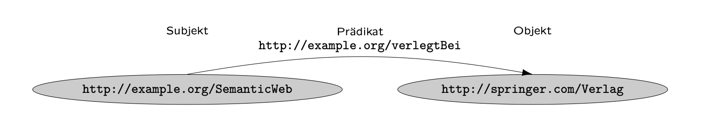

# 🔗 Linked Data, URIs and RDF

## Linked Data

Linked Data unlocks the potential of the Web by connecting information across different sources. This requires two key ingredients: URIs and RDF.

## What are URIs (Uniform Resource Identifiers)?

Imagine them as unique addresses for anything on the web, not just websites. Just like your home address identifies your house, a URI precisely identifies a specific resource, be it a person, a product, a document, or even an abstract concept.

### URI Anatomy

- **Scheme:** Identifies the protocol (e.g., http, ftp).
- **Authority:** Optional for internal resources (e.g., [www.example.com](https://www.example.com)).
- **Path:** Specifies the location within the source (e.g., /articles/2024/linked-data).
- **Query:** (Optional) Filters information within the resource (e.g., ?author=john).
- **Fragment:** (Optional) Points to a specific part of the resource (e.g., #introduction).

### URLs, URNs and IRIs

- URLs primarily address web pages
- URNs (Uniform Resource Names) identify resources without relying on internet access, and
- IRIs (Internationalized Resource Identifiers) allow for Unicode characters.

### Using HTTP-URIs

Instead of using plain text labels, assign URIs to real-world entities like people, organizations, or products. This enables precise identification and linking across different datasets.

- `http://example.org/my_name`
- `http://example.org/bank_(creditinstitute)`
- `http://example.org/bank_(bench)`

## RDF

RDF is modeling through pointed graphs. [RDF](https://www.w3.org/RDF/) is rcommandation by W3C. Constituents of RDF are:

- URIs: unambiguous referencing of resources Graph -> representation: ellipses
- Literals: e.g. Numbers, Dates, Strings -> representation: rectangles
- Empty Nodes: allows existence statements about an entity -> representation: empty ellipses

### Literals

Literals represent data values as string of characters. The default value is of type string.

Literals (Source, J., Hladik, (1))

### RDF-Graph and RDF-Triples

A RDF-Graph is a set of RDF-Triples.
A RDF-Triple constists of a subject (start-node), Predicate (Edge), and an object (end-node).
Allowed are:

- Subject URI (or empty node)
- Predicate URI
- Predicate URI or loteral (or empty node)

## 

RDF-Triples (Source, J., Hladik, (1))

## 🧠 Rember

1. Use URIs as names for things.
2. Use HTTP URIs so that people can look up those names.
3. When someone looks up a URI, provide useful information, using the standards (RDF\*, SPARQL).
4. Include links to other URIs so that they can discover more things.

## 🦆 References

1. J., Hladik, "Semantic Web", Duale Hochschule Baden-Württemberg, Stuttgart (fetched February 2024)

Optimized with [GEMINI](https://gemini.google.com/app)
